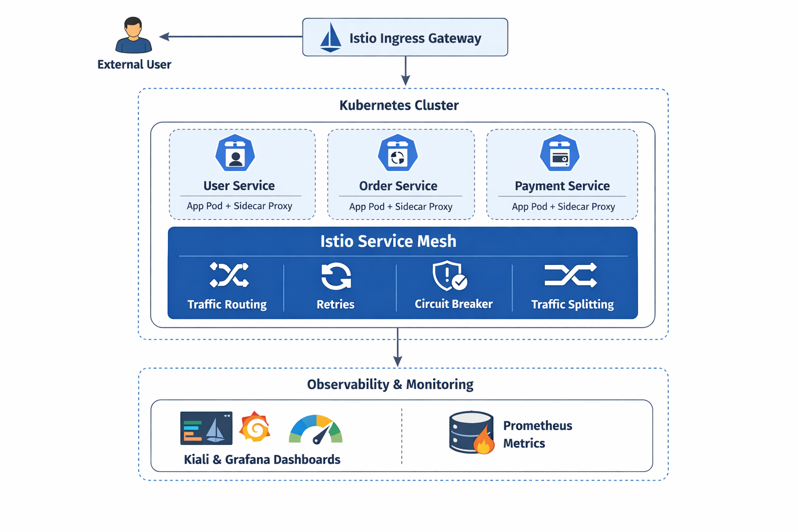
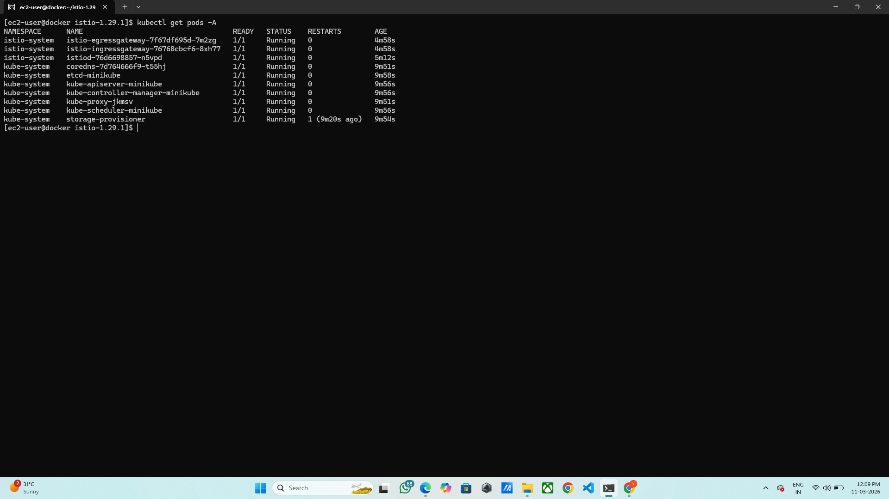
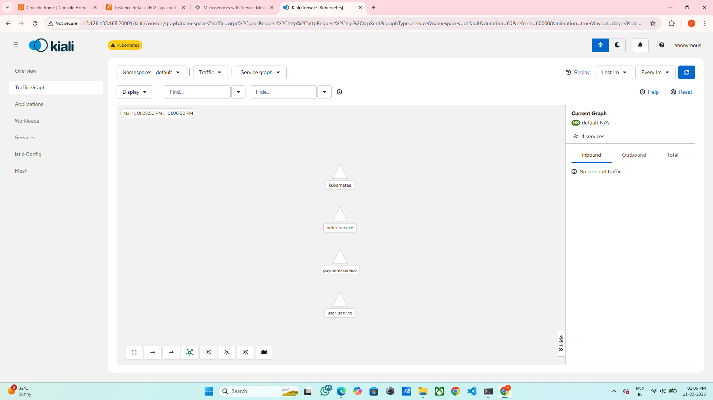
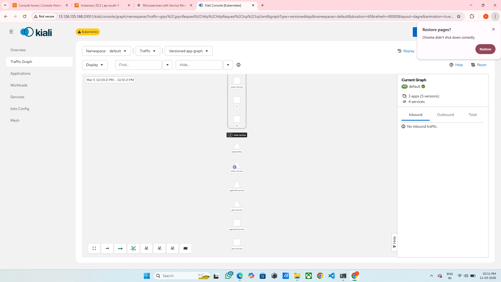

# Containerized Multi-Service Application with Service Mesh and Internal Traffic Control

# Architecture Digram :


## Project Overview
You joined as a Platform Engineer in a product company migrating from a monolithic architecture to microservices. Developers reported issues such as:

- Lack of visibility into service-to-service communication
- No traffic control
- No retry or circuit breaker mechanism

**Objective:** Deploy a multi-service Kubernetes application and implement service mesh capabilities for traffic routing, observability, and failure handling.

---

## Project Components

### Microservices
1. **User Service** – Handles user data and profiles
2. **Order Service** – Manages orders, order history, and order validation
3. **Payment Service** – Handles payment processing and validation

---

## Technologies & Tools
- Kubernetes
- Docker
- Istio (Service Mesh)
- kubectl
- Flask (for microservices)
- Requests & Gunicorn (for service API handling)

---

## Setup Instructions

### 1. Kubernetes Cluster Setup
- Started minikube cluster using Docker driver:
```bash
minikube start --driver=docker
```

Verified cluster:
```
kubectl get nodes
kubectl get pods -A

```

Screenshot: Cluster & Pods status



### 2. Containerization

Created Dockerfiles for all services.

Created requirements.txt for Python dependencies:
```
flask==2.3.2
requests==2.31.0
gunicorn==21.2.0
```
Built Docker images:
```
docker build -t <dockerhub-username>/user-service:v1 .
docker build -t <dockerhub-username>/order-service:v1 .
docker build -t <dockerhub-username>/payment-service:v1 .
```
Pushed images to Docker Hub:
```
docker push <dockerhub-username>/user-service:v1
docker push <dockerhub-username>/order-service:v1
docker push <dockerhub-username>/payment-service:v1
```
Screenshot: Docker build & push logs


#### 3. Deploy Microservices to Kubernetes

Applied deployment and service YAML files:
```
kubectl apply -f user-deployment.yaml
kubectl apply -f order-deployment.yaml
kubectl apply -f payment-deployment.yaml
```
Verified pods and services:
```
kubectl get pods
kubectl get svc
```
Screenshot: Microservices running


#### 4. Service Mesh Installation (Istio)

Installed Istio and enabled sidecar injection:
```
istioctl install --set profile=demo
kubectl label namespace default istio-injection=enabled --overwrite
```
Verified Istio pods:
```
kubectl get pods -n istio-system
```
Screenshot: Istio system pods


#### 5. Traffic Management

Created DestinationRule and VirtualService for order-service:
```
# order-destinationrule.yaml
apiVersion: networking.istio.io/v1alpha3
kind: DestinationRule
metadata:
  name: order-service
spec:
  host: order-service
  trafficPolicy:
    connectionPool:
      tcp:
        maxConnections: 100
      http:
        http1MaxPendingRequests: 50
        maxRequestsPerConnection: 10
    outlierDetection:
      consecutive5xxErrors: 1
      interval: 5s
      baseEjectionTime: 30s
      maxEjectionPercent: 100
```
```
# order-traffic-split.yaml
apiVersion: networking.istio.io/v1alpha3
kind: VirtualService
metadata:
  name: order-service
spec:
  hosts:
  - order-service
  http:
  - route:
    - destination:
        host: order-service
        subset: v1
      weight: 80
    - destination:
        host: order-service
        subset: v2
      weight: 20
    retries:
      attempts: 3
      perTryTimeout: 2s
      retryOn: gateway-error,connect-failure,refused-stream
```
Screenshot: Traffic split in Kiali


#### 6. Observability

Enabled Kiali, Prometheus, and Grafana for monitoring.

Accessed Kiali dashboard:
```
kubectl port-forward svc/kiali -n istio-system 20001:20001 --address 0.0.0.0
```
Screenshot: Kiali Dashboard showing traffic and services



Observed metrics such as:
```
Request latency

Error rate

Service health
```


## Service Mesh Benefits

Provides visibility into service-to-service communication

Allows traffic routing and splitting

Enables retries, circuit breakers, and failure handling

Collects metrics and monitoring for observability

## Traffic Control Logic

VirtualService defines the route and weights for v1/v2 services

Retries configured to handle temporary failures

DestinationRules enforce connection pool limits and outlier detection

Enables smooth deployment and gradual traffic migration between versions

## Notes

Screenshots should be replaced with actual images taken during deployment.

Docker Hub username should be replaced with your own account.

Ensure Istio sidecar injection is enabled for all namespaces running microservices.

## Conclusion

This project successfully demonstrates:

Migration from monolithic to microservice architecture

Effective internal traffic control and routing using Istio

Observability and monitoring using Kiali and Prometheus

Failure handling through retries and circuit breakers

## Key Lessons Learned

Sidecar injection is essential for traffic management

Istio integrates smoothly with Kubernetes clusters

Observability helps catch errors before they impact users

Proper Docker image management is crucial

## Challenges

Docker Hub authentication issues

Firewall and port-forwarding for dashboard access

YAML misconfigurations for traffic splitting

## Future Enhancements

Automate deployment using CI/CD pipelines

Add alerting & notification using Prometheus/Grafana

Expand services and implement API gateways

Explore Istio Ambient Mesh for advanced security

## Author

**Aditya Satish Chavan**    
Email: adityachavan5151@gmail.com
